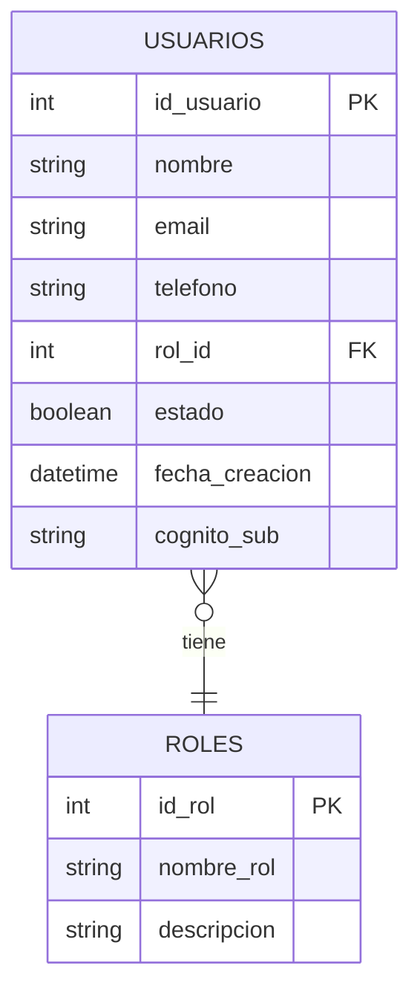

```mermaid
erDiagram
    USUARIOS {
        int id_usuario PK
        string nombre
        string email
        string telefono
        int rol_id FK
        boolean estado
        datetime fecha_creacion
        string cognito_sub
    }

    ROLES {
        int id_rol PK
        string nombre_rol
        string descripcion
    }

    USUARIOS }o--|| ROLES : "tiene"
```
